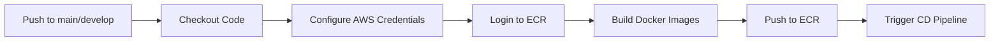
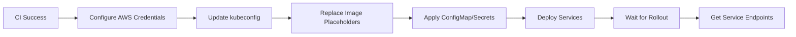

# Quick Start Guide - CI/CD Pipeline for EKS

This guide provides a quick overview of the CI/CD pipeline setup for deploying the Voting App to AWS EKS.

> Key Runtime Requirements: RDS requires SSL, Redis AUTH is disabled (only TLS), Socket.IO path is `/result/socket.io`, images must build for `linux/amd64`, ConfigMap must separate `postgres_host` and `postgres_port`.

## Overview

The CI/CD pipeline consists of two GitHub Actions workflows:

1. **CI Pipeline** (`ci-build-push.yml`): Builds Docker images and pushes them to Amazon ECR
2. **CD Pipeline** (`cd-deploy-eks.yml`): Deploys the application to Amazon EKS cluster

## Prerequisites Checklist

- [ ] AWS Account with appropriate permissions
- [ ] EKS Cluster created and running
- [ ] ECR repositories created (vote, result, worker)
- [ ] ElastiCache Redis cluster created (optional, for production)
- [ ] RDS PostgreSQL instance created (optional, for production)
- [ ] IAM OIDC provider configured for GitHub Actions
- [ ] GitHub repository secrets configured
- [ ] ALB Ingress Controller installed (for ingress-based exposure)
- [ ] Access Entry / RBAC mapping for GitHub Actions principal

## Required GitHub Secrets

Configure these secrets in your GitHub repository (Settings → Secrets and variables → Actions):

| Secret Name | Description | Example |
|-------------|-------------|---------|
| `AWS_ACCOUNT_ID` | Your AWS Account ID | `123456789012` |
| `AWS_ROLE_ARN` | IAM Role ARN for GitHub Actions | `arn:aws:iam::123456789012:role/GitHubActionsVotingAppRole` |

Optional (if using AWS managed services):
| Secret Name | Description |
|-------------|-------------|
| `REDIS_AUTH_TOKEN` | ElastiCache Redis AUTH token |
| `DB_PASSWORD` | RDS PostgreSQL password |

Note: Redis AUTH token is unused if AUTH disabled; omit the secret to avoid confusion.

## Quick Setup Steps

### 1. Set AWS Region

Edit both workflow files and update the AWS region if different from `us-east-1`:

```yaml
env:
  AWS_REGION: us-east-1  # Change this to your region
```

### 2. Update EKS Cluster Name

Edit `cd-deploy-eks.yml` and set your cluster name:

```yaml
env:
  EKS_CLUSTER_NAME: voting-app-cluster  # Change this to your cluster name
```

### 3. Configure Kubernetes Resources

#### Update ConfigMap
Edit `k8s-specifications/configmap.yaml`:

```yaml
data:
  redis_host: "your-elasticache-endpoint.cache.amazonaws.com"
  redis_port: "6379"
  redis_ssl: "true"
  postgres_host: "your-rds-endpoint.rds.amazonaws.com"
  postgres_port: "5432"
```

#### Create Secrets in Kubernetes (If not using External Secrets Operator)

```bash
kubectl create namespace voting-app

 # Skip redis-secret if Redis AUTH disabled

kubectl create secret generic db-secret \
  --from-literal=username='postgres' \
  --from-literal=password='your-db-password' \
  -n voting-app
```

#### Apply ConfigMap

```bash
kubectl apply -f k8s-specifications/configmap.yaml -n voting-app
```

### 4. Update Deployment Image References

The workflow automatically updates image references, but verify the placeholders in deployment files:

- `k8s-specifications/vote-deployment.yaml`
- `k8s-specifications/result-deployment.yaml`
- `k8s-specifications/worker-deployment.yaml`

Each should have:
```yaml
image: <AWS_ACCOUNT_ID>.dkr.ecr.<AWS_REGION>.amazonaws.com/<service>:latest
```

### 5. Trigger the Pipeline

Push to the main branch or manually trigger the workflow:

```bash
git add .
git commit -m "Configure CI/CD pipeline"
git push origin main
```

Or manually trigger from GitHub Actions UI.

## Pipeline Workflow

### CI Pipeline (Automatic on Push)



**Triggers:**
- Push to `main` or `develop` branches
- Pull requests to `main`

**Actions:**
1. Builds three Docker images (vote, result, worker)
2. Pushes images to ECR with multiple tags:
   - `latest` (for main branch)
   - Branch name (e.g., `main`, `develop`)
   - Git SHA (e.g., `main-abc1234`)

### CD Pipeline (Automatic after CI or Manual)



**Triggers:**
- Automatic: After successful CI pipeline completion on `main` branch
- Manual: Via GitHub Actions `workflow_dispatch`

**Actions:**
1. Updates kubeconfig for EKS cluster
2. Replaces image placeholders with actual ECR URIs
3. Applies Kubernetes manifests
4. Waits for deployment rollout to complete
5. Displays service endpoints
 6. (Optional) Restarts `result` deployment after `worker` table creation (race mitigation)

## Monitoring Deployment

### View GitHub Actions Logs

1. Go to your GitHub repository
2. Click on "Actions" tab
3. Select the workflow run
4. View logs for each job

### Check EKS Deployment Status

```bash
# Set kubeconfig
aws eks update-kubeconfig --name voting-app-cluster --region us-east-1

# Check all resources
kubectl get all -n voting-app

# Check pod status
kubectl get pods -n voting-app -w

# Check deployment status
kubectl rollout status deployment/vote -n voting-app
kubectl rollout status deployment/result -n voting-app
kubectl rollout status deployment/worker -n voting-app

# View logs
kubectl logs -f deployment/vote -n voting-app
kubectl logs -f deployment/result -n voting-app
kubectl logs -f deployment/worker -n voting-app
```

### Get Application URLs

```bash
# Get vote service URL
kubectl get service vote -n voting-app

# Get result service URL
kubectl get service result -n voting-app
```

If using LoadBalancer type, get the external hostname:

```bash
VOTE_URL=$(kubectl get service vote -n voting-app -o jsonpath='{.status.loadBalancer.ingress[0].hostname}')
echo "Vote app: http://$VOTE_URL"

RESULT_URL=$(kubectl get service result -n voting-app -o jsonpath='{.status.loadBalancer.ingress[0].hostname}')
echo "Result app: http://$RESULT_URL"
```

## Troubleshooting

### CI Pipeline Issues

**Problem:** ECR login fails
```bash
# Solution: Verify IAM role has ECR permissions
aws ecr describe-repositories
```

**Problem:** Image build fails
```bash
# Solution: Check Dockerfile syntax and build context
docker build -t test ./vote
```

### CD Pipeline Issues

**Problem:** Cannot connect to EKS cluster
```bash
# Solution: Verify IAM role has EKS permissions and RBAC is configured
kubectl auth can-i get pods -n voting-app --as=github-actions
```

**Problem:** Pods in CrashLoopBackOff
```bash
# Solution: Check pod logs and events
kubectl describe pod <pod-name> -n voting-app
kubectl logs <pod-name> -n voting-app --previous
```

**Problem:** Result UI not updating live
```bash
# Solution: Verify ingress annotations for WebSocket / sticky sessions
kubectl describe ingress -n voting-app | grep -E 'alb.ingress.kubernetes.io/(sticky-session|backend-protocol-version|load-balancer-attributes)'
# Ensure Socket.IO path matches /result/socket.io in server code
kubectl logs deployment/result -n voting-app | grep socket.io
```

**Problem:** PostgreSQL SSL errors
```bash
# Solution: Confirm SSL mode enforced in app logs
kubectl logs deployment/result -n voting-app | grep -i SSL
kubectl logs deployment/worker -n voting-app | grep -i SSL
```

**Problem:** Redis AUTH failure
```bash
# Solution: Remove REDIS_PASSWORD from deployment env; confirm no AUTH attempts
kubectl logs deployment/vote -n voting-app | grep -i redis
```

**Problem:** Cannot reach services
```bash
# Solution: Check service and ingress configuration
kubectl get svc -n voting-app
kubectl describe svc vote -n voting-app
```

### Common Errors

| Error | Cause | Solution |
|-------|-------|----------|
| `ImagePullBackOff` | ECR access denied | Verify IRSA or node IAM role has ECR read permissions |
| `CrashLoopBackOff` | App configuration error | Check environment variables and secrets |
| `Pending` pods | Insufficient resources | Scale up node group or adjust resource requests |
| `LoadBalancer pending` | Security group issue | Check VPC and subnet configuration |
| No real-time updates | Missing ingress WebSocket annotations | Add ALB annotations & restart result |
| DB connectivity retries | Incorrect host/port or SSL missing | Fix ConfigMap splitting host/port, enforce SSL |

## Manual Deployment

If you need to deploy manually without GitHub Actions:

```bash
# Login to ECR
aws ecr get-login-password --region us-east-1 | docker login --username AWS --password-stdin <AWS_ACCOUNT_ID>.dkr.ecr.us-east-1.amazonaws.com

# Build and push images
docker build -t <AWS_ACCOUNT_ID>.dkr.ecr.us-east-1.amazonaws.com/vote:latest ./vote
docker push <AWS_ACCOUNT_ID>.dkr.ecr.us-east-1.amazonaws.com/vote:latest

docker build -t <AWS_ACCOUNT_ID>.dkr.ecr.us-east-1.amazonaws.com/result:latest ./result
docker push <AWS_ACCOUNT_ID>.dkr.ecr.us-east-1.amazonaws.com/result:latest

docker build -t <AWS_ACCOUNT_ID>.dkr.ecr.us-east-1.amazonaws.com/worker:latest ./worker
docker push <AWS_ACCOUNT_ID>.dkr.ecr.us-east-1.amazonaws.com/worker:latest

# Deploy to EKS
kubectl apply -f k8s-specifications/ -n voting-app
```

## Rollback

If you need to rollback a deployment:

```bash
# Rollback to previous version
kubectl rollout undo deployment/vote -n voting-app
kubectl rollout undo deployment/result -n voting-app
kubectl rollout undo deployment/worker -n voting-app

# Rollback to specific revision
kubectl rollout history deployment/vote -n voting-app
kubectl rollout undo deployment/vote --to-revision=2 -n voting-app
```

## Environment Management

### Deploy to Different Environments

Use Kustomize for environment-specific configurations:

```bash
# Development
kubectl apply -k k8s-specifications/overlays/dev

# Staging
kubectl apply -k k8s-specifications/overlays/staging

# Production
kubectl apply -k k8s-specifications/overlays/production
```

## Scaling

### Manual Scaling

```bash
# Scale deployments
kubectl scale deployment vote --replicas=3 -n voting-app
kubectl scale deployment result --replicas=2 -n voting-app
```

### Auto Scaling

Install Metrics Server:

```bash
kubectl apply -f https://github.com/kubernetes-sigs/metrics-server/releases/latest/download/components.yaml
```

Create HPA:

```bash
kubectl autoscale deployment vote --cpu-percent=70 --min=2 --max=10 -n voting-app
kubectl autoscale deployment result --cpu-percent=70 --min=2 --max=5 -n voting-app
```

## Next Steps

- [ ] Set up monitoring with CloudWatch or Prometheus
- [ ] Configure alerting for deployment failures
- [ ] Implement blue-green or canary deployments
- [ ] Add automated testing in CI pipeline
- [ ] Set up GitOps with ArgoCD or Flux
- [ ] Implement backup and disaster recovery
- [ ] Configure cost monitoring and alerts

## Additional Resources

- [AWS EKS Documentation](https://docs.aws.amazon.com/eks/)
- [GitHub Actions Documentation](https://docs.github.com/en/actions)
- [Kubernetes Documentation](https://kubernetes.io/docs/)
- Full setup guide: See `docs/AWS_SETUP.md`
- Manual testing path: See `docs/MANUAL_DEPLOYMENT.md`
- Access configuration: See `docs/EKS_ACCESS_FIX.md`
- Secrets handling: See `docs/EXTERNAL_SECRETS.md`
- Ingress / WebSockets: See `docs/INGRESS_SETUP.md`
